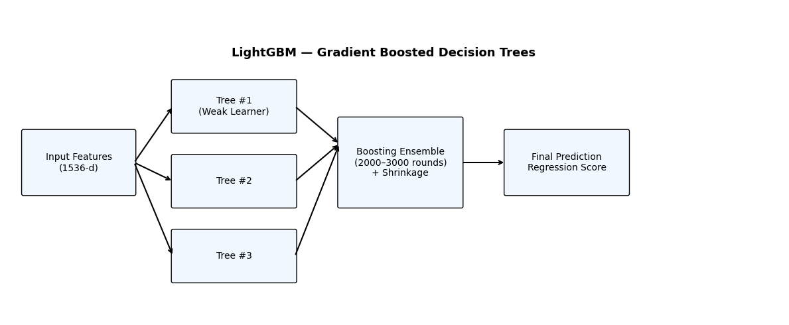
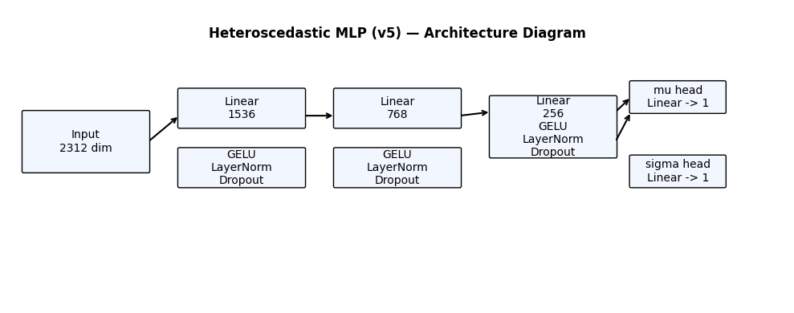
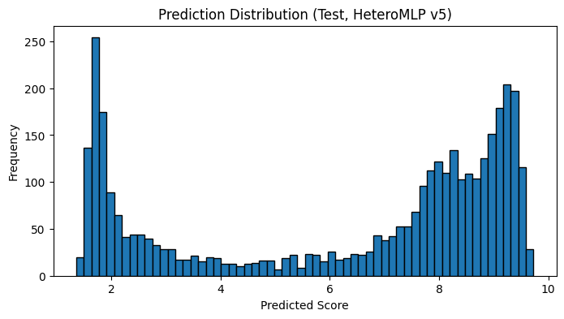

# 🌟 Kaggle Leaderboard Project  
**Author:** Aditya Thakur (DA25M004)  
**Date:** November 2025  

This repository contains the complete workflow for predicting LLM response-quality scores using multilingual text embeddings, metric embeddings, augmentation strategies, and a final heteroscedastic neural model that achieved **2.055 RMSE** on the public leaderboard.

---

# 📌 Table of Contents
- [1. Project Overview](#1-project-overview)
- [2. Dataset & Preprocessing](#2-dataset--preprocessing)
- [3. Embedding Pipeline](#3-embedding-pipeline)
- [4. Baseline Models](#4-baseline-models)
- [5. Failed Balancing Attempts](#5-failed-balancing-attempts)
- [6. Negative Sampling Strategy](#6-negative-sampling-strategy)
- [7. LightGBM with Augmented Features](#7-lightgbm-with-augmented-features)
- [8. Final Model — Heteroscedastic MLP](#8-final-model--heteroscedastic-mlp)
- [9. Results Summary](#9-results-summary)
- [10. Conclusion](#10-conclusion)

---

# 1️⃣ **Project Overview**

This project uses a three-notebook pipeline:

1. **Initial Assignment Analysis** → preprocessing, MPNet embeddings, PCA/UMAP  
2. **Model Development Phase** → baseline models, failed balancing attempts, negative sampling  
3. **Final Model & Evaluation** → heteroscedastic neural model  

The objective is to predict human judge scores (**0–10**) for LLM responses given:

- System prompt  
- User prompt  
- Response text  
- Safety metric name  

---

# 2️⃣ **Dataset & Preprocessing**

### Files
| File | Description |
|------|-------------|
| `train_data.json` | 5000 labeled samples |
| `test_data.json` | 3638 unlabeled samples |
| `metric_names.json` | 145 safety metric names |
| `metric_name_embeddings.npy` | 145 × 768 metric embeddings |

### Preprocessing Steps
- Remove `"None"` and normalize whitespace  
- Replace missing system prompts with empty strings  
- Map metric names → integer IDs  
- Attach their 768-dim embeddings  
- Build combined text strings for embedding  
- Save `notebook1_full_dump.joblib` for reproducibility  

---

# 3️⃣ **Embedding Pipeline**

### 📌 MPNet Model  
`paraphrase-multilingual-mpnet-base-v2`

- Supports multilingual text (Hindi, Tamil, English…)  
- Produces high-quality 768-dim embeddings  
- Handles long inputs using:  
  - **512-token window**  
  - **256-token stride**  
  - Weighted average of chunk embeddings  

### 📊 Embedding Quality Check
- PCA and UMAP show **score does not directly correlate with embedding space**  
- k-NN regression baseline RMSE ≈ **0.89** → meaningful signal present  

---

# 4️⃣ **Baseline Models**

Baseline feature-engineered models:

| Model | Performance |
|-------|-------------|
| Linear Regression | RMSE ≈ 0.936 |
| LightGBM | RMSE ≈ 0.894 |
| CatBoost Classifier | Macro-F1 ≈ 0.107 |

All **collapse to scores 9–10** due to dataset imbalance.

---

# 5️⃣ **Failed Balancing Attempts**

Several attempts were made to force the model to learn low-score behavior:

- Oversampling minority classes (failed → duplicate samples)  
- Embedding interpolation (failed → unrealistic samples)  
- Weighted MLPs  
- Weighted SVR  
- Gaussian Process Meta-Learning + CatBoost  

All produced RMSE: **3.7–3.9**  
Still collapsed into high-score distribution.

---

# 6️⃣ **Negative Sampling Strategy (Major Breakthrough)**

We introduce realistic low-scoring samples:

1. **Mismatched text embeddings**  
2. **Embeddings with Gaussian noise**  
3. **Metric-mismatched embeddings**

All synthetic samples assigned **score 0–2**.  

After augmentation, the training distribution becomes **balanced** and models begin learning meaningful low-score patterns.

---

# 7️⃣ **LightGBM with Augmented Features**

### 📌 Inputs (1536-dim)
- 768-dim combined MPNet embedding  
- 768-dim metric embedding  

### 📈 Model Architecture

Training details:

- 5-fold CV  
- MAE metric  
- 3000 boosting rounds (with early stopping)  
- Achieved **RMSE = 2.579** on public leaderboard  

Validation curves show smooth and stable convergence.

---

# 8️⃣ **Final Model — Heteroscedastic MLP (Best Model)**

The final neural model predicts:

- Mean score **μ**  
- Log-variance **log(σ²)**  

### 🧠 Model Architecture Diagram  
(2312-dim input → 3 hidden layers → μ and σ heads)

### 🔧 Architecture

### 📌 Loss Function

$$
\mathcal{L} = 0.45 \cdot NLL + 0.55 \cdot MAE
$$

### 📘 Cross-Validation Results
- Best fold MAE: **1.49–1.70**  
- Final OOF MAE: **1.6823**

### 📊 Test Prediction Distribution  
This model does **NOT collapse** to the mean (unlike earlier models):

Inference statistics:
- Min = **1.355**  
- Max = **9.732**  
- Mean = **6.309**  
- Std = **2.960**  

### 🚀 Final Public LB Score: **2.055 RMSE**  
(Top performing model)

---

# 9️⃣ **Results Summary**

| Model Type | Public LB RMSE |
|------------|----------------|
| Classical Baselines | 3.8–3.9 |
| Failed Balanced Models | 3.7–3.9 |
| **LightGBM + Augmented Features** | **2.579** |
| **Heteroscedastic MLP (Final)** | **2.055** |

---

# 🔟 **Conclusion**

- The dataset’s extreme skew made standard models ineffective.  
- Oversampling and interpolation were insufficient.  
- Negative sampling produced realistic low-score structure.  
- LightGBM validated the feature quality.  
- The final **heteroscedastic MLP** excelled by predicting both score and uncertainty.  
- Achieved **2.055 RMSE**, a major improvement over all prior methods.

---

